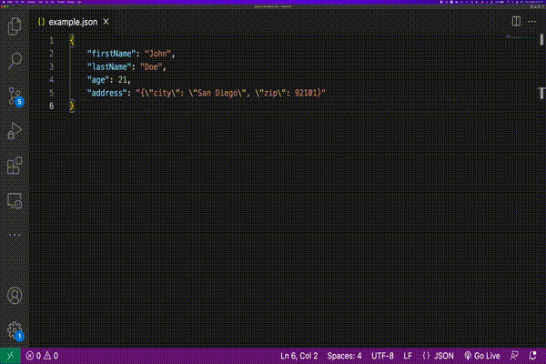

# embedded-json

Visual Studio Code Extension to unwrap string encoded embedded JSON.

## Features

This extension can unwarp embedded string JSONs to expand to the full JSON.

For example you have a input JSON like that:

```json
{
  "firstName": "John",
  "lastName": "Doe",
  "age": 21,
  "address": "{\"city\": \"San Diego\", \"zip\": 92101}"
}
```

This extension will unwrap it to this example.

```json
{
    "firstName": "John",
    "lastName": "Doe",
    "age": 21,
    "address": {
        "city": "San Diego",
        "zip": 92101
    }
}
```


